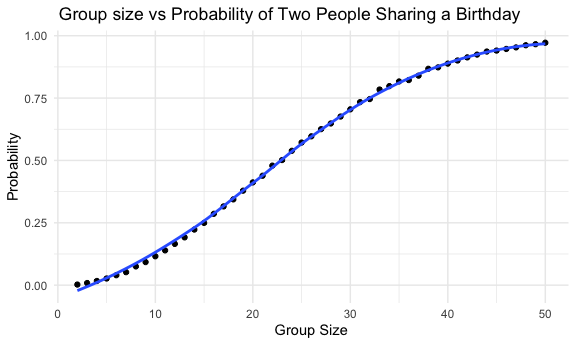
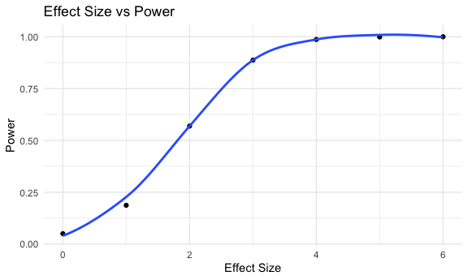

p8105_hw5_kr3145
================
Kallan Roan
2025-11-08

Load libraries

``` r
library(tidyverse)
```

    ## ── Attaching core tidyverse packages ──────────────────────── tidyverse 2.0.0 ──
    ## ✔ dplyr     1.1.4     ✔ readr     2.1.5
    ## ✔ forcats   1.0.0     ✔ stringr   1.5.1
    ## ✔ ggplot2   3.5.2     ✔ tibble    3.3.0
    ## ✔ lubridate 1.9.4     ✔ tidyr     1.3.1
    ## ✔ purrr     1.1.0     
    ## ── Conflicts ────────────────────────────────────────── tidyverse_conflicts() ──
    ## ✖ dplyr::filter() masks stats::filter()
    ## ✖ dplyr::lag()    masks stats::lag()
    ## ℹ Use the conflicted package (<http://conflicted.r-lib.org/>) to force all conflicts to become errors

Preset settings

``` r
knitr::opts_chunk$set(
  fig.width = 6,
  fig.asp = .6,
  out.width = "90%"
)

theme_set(theme_minimal() + theme(legend.position = "bottom"))

options(
  ggplot2.continuous.colour = "viridis",
  ggplot2.continuous.fill = "viridis"
)

scale_colour_discrete = scale_colour_viridis_d
scale_fill_discrete = scale_fill_viridis_d
```

set seed

``` r
set.seed(1)
```

## Problem 1

Create function

``` r
bday_sim = function(n_room) {
  
  birthdays = sample(1:365, n_room, replace = TRUE)
  
  repeated_bday = length(unique(birthdays)) < n_room
  
  repeated_bday
  
}
```

Create simulation for group size between 2 and 50

``` r
sim_results_df = 
  expand_grid(
    sample_size = 2:50, 
    iter = 1:10000
  ) |> 
  mutate(
    results = map(sample_size, bday_sim)
  ) |> 
  unnest(results)
```

Use simulation results to calculate probability and plot

``` r
sim_results_df |> 
  group_by(sample_size) |> 
  summarize(
    prob = mean(results)
  ) |> 
  ggplot(aes(x = sample_size, y = prob)) +
  geom_point() +
  geom_smooth(se = FALSE) +
  labs(
    x = "Group Size",
    y = "Probability"
  ) 
```

    ## `geom_smooth()` using method = 'loess' and formula = 'y ~ x'



The plot shows that as the group size increases, the probability that at
last 2 people in the group will share a birthday will also increase. The
increase starts to plateau slightly as it gets to group size of 50.

## Problem 2

Create function for running t-test for means 0 to 6

``` r
t_test_fctn = function(m) {
  
  num_vec = rnorm(30, m, sd = 5)
  
  t_test = t.test(num_vec, mu = 0)
  
  t_test
  
}
```

Run simulation 5000 times, pulling estimate and p-value

``` r
sim_results_2_df = 
  expand_grid(
    mean = 0:6,
    iter = 1:5000
  ) |> 
  mutate(
    results = map(mean, t_test_fctn),
    results = map(results, broom::tidy)
  ) |> 
  unnest(results) |> 
  select(mean:p.value)
```

Plot \#1

``` r
sim_results_2_df |> 
  mutate(
    reject_null = p.value <= 0.05
  ) |> 
  group_by(mean) |> 
  summarize(
    power = mean(reject_null)
  ) |> 
  ggplot(aes(x = mean, y = power)) +
  geom_point() +
  geom_smooth(se = FALSE) +
  labs(
    x = "Effect",
    y = "Power"
  ) 
```

    ## `geom_smooth()` using method = 'loess' and formula = 'y ~ x'



?????????????DESCRIPTION OF PLOT HERE???????????

Plot \#2

``` r
sim_results_2_df |> 
  group_by(mean) |> 
  summarize(
    avg_estimate_mean = mean(estimate)
  ) |> 
  ggplot(aes(x = mean, y = avg_estimate_mean)) +
  geom_point() +
  geom_smooth(se = FALSE) +
  labs(
    title = "True mean vs average estimate of mean",
    x = "True mean",
    y = "Average estimate of mean"
  ) 
```

    ## `geom_smooth()` using method = 'loess' and formula = 'y ~ x'


``` r
sim_results_2_df |> 
  filter(p.value <= 0.05) |> 
  group_by(mean) |> 
  summarize(
    avg_estimate_mean = mean(estimate)
  ) |> 
  ggplot(aes(x = mean, y = avg_estimate_mean)) +
  geom_point() +
  geom_smooth(se = FALSE) +
  labs(
    title = "True mean vs average estimate of mean \nonly for when null was rejected",
    x = "True mean",
    y = "Average estimate of mean"
  ) 
```

    ## `geom_smooth()` using method = 'loess' and formula = 'y ~ x'


?????????????DESCRIPTION OF PLOT HERE???????????

Alternative (may delete later)

``` r
sim_results_2_df |> 
  mutate(
    reject_null = p.value <= 0.05
  ) |> 
  group_by(mean, reject_null) |> 
  summarize(
    avg_estimate_mean = mean(estimate)
  ) |> 
  ggplot(aes(x = mean, y = avg_estimate_mean, color = reject_null)) +
  geom_point()
```

    ## `summarise()` has grouped output by 'mean'. You can override using the
    ## `.groups` argument.


## Question 3
